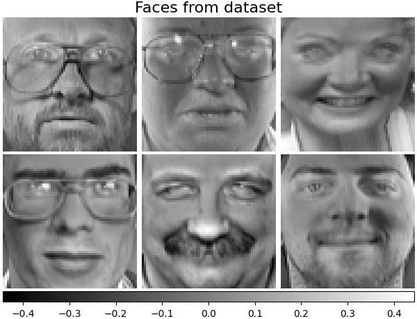
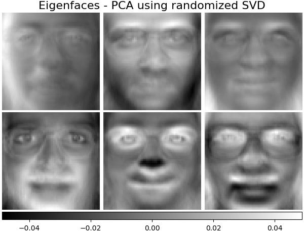
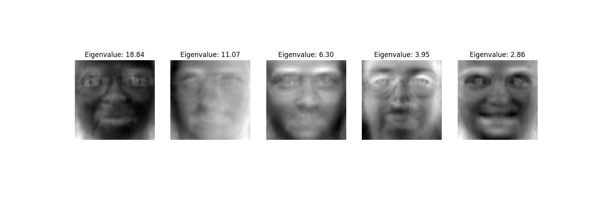
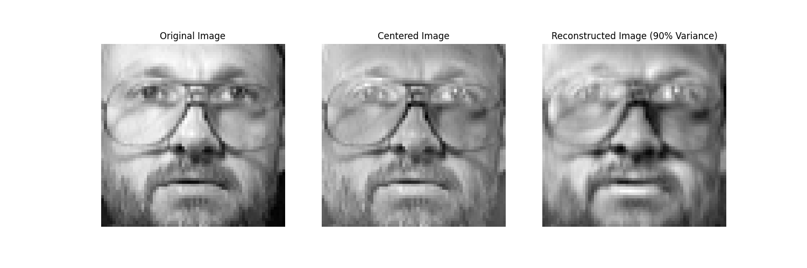
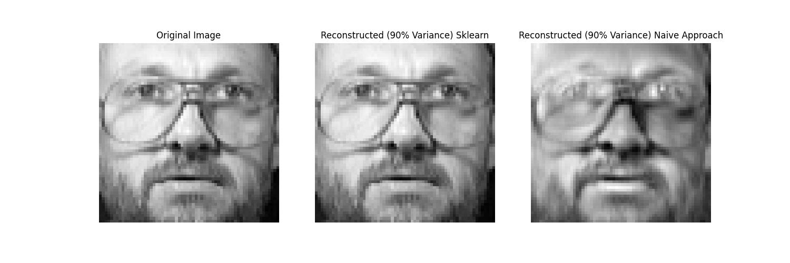

Principal Component Analysis (PCA) is one of the most fundamental dimensionality reduction algorithms in machine learning and data science. When applied to 2D image data, the principal components can themselves be visualized as images, famously termed **Eigenfaces** (Turk & Pentland, 1991).

In this article, we formulate PCA from first principles using spectral matrix theory, implement a custom solver from scratch in NumPy, and evaluate it on the AT&T Olivetti Faces dataset, comparing reconstruction fidelity directly with `sklearn.decomposition.PCA`.

---

## 1. Mathematical Foundations

Let our dataset consist of $N$ face images, where each image is an $h \times w$ grayscale image flattened into a row vector $x_i \in \mathbb{R}^D$ ($D = h \cdot w$). The full data matrix is:

$$
X = \begin{pmatrix} x_1^T \\ x_2^T \\ \vdots \\ x_N^T \end{pmatrix} \in \mathbb{R}^{N \times D}
$$

For the Olivetti dataset, $N = 400$ and each face is $64 \times 64$, meaning $D = 4096$.

### Step 1: Mean Centering
Compute the empirical mean vector $\mu \in \mathbb{R}^D$:

$$
\mu = \frac{1}{N} \sum_{i=1}^N x_i
$$

The centered data matrix $\tilde{X}$ is defined by subtracting $\mu$ from every row:

$$
\tilde{X} = X - \mathbf{1}_N \mu^T \in \mathbb{R}^{N \times D}
$$

### Step 2: Covariance Matrix & Eigendecomposition
The sample covariance matrix $\Sigma \in \mathbb{R}^{D \times D}$ is:

$$
\Sigma = \frac{1}{N - 1} \tilde{X}^T \tilde{X}
$$

Since $\Sigma$ is symmetric and positive semi-definite, the **Spectral Theorem** guarantees an orthonormal basis of eigenvectors $v_1, v_2, \dots, v_D \in \mathbb{R}^D$ with real non-negative eigenvalues:

$$
\Sigma v_i = \lambda_i v_i, \quad \lambda_1 \ge \lambda_2 \ge \dots \ge \lambda_D \ge 0
$$

### Step 3: Computational Trick for High Dimensions ($N \ll D$)
Notice that $\Sigma$ has dimensions $4096 \times 4096$ ($\approx 16.8 \times 10^6$ entries). Direct eigendecomposition of a $4096 \times 4096$ matrix is computationally intensive.

However, since $N = 400 \ll D = 4096$, $\text{rank}(\tilde{X}) \le N - 1 = 399$. Following **Sirovich & Kirby (1987)**, we can consider the smaller $N \times N$ inner product (Gram) matrix:

$$
K = \frac{1}{N - 1} \tilde{X} \tilde{X}^T \in \mathbb{R}^{N \times N}
$$

If $u_i \in \mathbb{R}^N$ is an eigenvector of $K$ with eigenvalue $\lambda_i$:

$$
\frac{1}{N - 1} \tilde{X} \tilde{X}^T u_i = \lambda_i u_i \implies \frac{1}{N - 1} \tilde{X}^T \tilde{X} (\tilde{X}^T u_i) = \lambda_i (\tilde{X}^T u_i)
$$

Thus, $v_i \propto \tilde{X}^T u_i$ is an eigenvector of $\Sigma$! Normalizing $v_i = \frac{\tilde{X}^T u_i}{\|\tilde{X}^T u_i\|}$ yields the exact principal components in $\mathcal{O}(N^3)$ time instead of $\mathcal{O}(D^3)$ time.

### Step 4: Subspace Selection (90% Explained Variance)
The proportion of total variance explained by the top $k$ principal components is:

$$
\eta(k) = \frac{\sum_{i=1}^k \lambda_i}{\sum_{i=1}^{\min(N-1, D)} \lambda_i}
$$

We select the smallest $k$ such that $\eta(k) \ge 0.90$.

### Step 5: Projection and Reconstruction
Let $V_k = (v_1, \dots, v_k) \in \mathbb{R}^{D \times k}$ be the projection matrix. The low-dimensional representation $Z \in \mathbb{R}^{N \times k}$ and the reconstructed faces $\hat{X} \in \mathbb{R}^{N \times D}$ are:

$$
Z = \tilde{X} V_k, \qquad \hat{X} = Z V_k^T + \mathbf{1}_N \mu^T
$$

---

## 2. The Olivetti Faces Dataset

The dataset consists of 400 grayscale images representing 40 individuals (10 distinct images per subject with varying lighting, facial expressions, and angles):

```python
import numpy as np
import matplotlib.pyplot as plt
from sklearn.datasets import fetch_olivetti_faces

# Load faces dataset
faces_data = fetch_olivetti_faces(shuffle=True, random_state=42)
faces = faces_data.images  # shape: (400, 64, 64)
X = faces_data.data        # shape: (400, 4096)
n_samples, n_features = X.shape

print(f"Dataset shape: {n_samples} samples, {n_features} features per sample.")
```

{fig-align="center" width=80%}

---

## 3. Scikit-Learn PCA Benchmark

We first establish a baseline using `sklearn.decomposition.PCA` configured to retain 90% of the variance:

```python
from sklearn.decomposition import PCA

# Fit scikit-learn PCA retaining 90% of explained variance
pca_sklearn = PCA(n_components=0.90, svd_solver='full')
X_sklearn_trans = pca_sklearn.fit_transform(X)
X_sklearn_recon = pca_sklearn.inverse_transform(X_sklearn_trans)

print(f"Components selected by scikit-learn for 90% variance: {pca_sklearn.n_components_}")
```

---

## 4. Custom PCA Implementation from Scratch

Below is the complete implementation of PCA in pure NumPy:

```python
class CustomPCA:
    def __init__(self, variance_threshold=0.90):
        self.variance_threshold = variance_threshold
        self.mean_ = None
        self.components_ = None
        self.explained_variance_ratio_ = None
        self.n_components_ = None

    def fit(self, X):
        # 1. Compute empirical mean and center the data
        self.mean_ = np.mean(X, axis=0)
        X_centered = X - self.mean_
        n_samples, n_features = X.shape

        # 2. Compute inner product matrix (Sirovich-Kirby technique)
        # K has shape (N, N) which is 400x400 instead of 4096x4096
        K = np.dot(X_centered, X_centered.T) / (n_samples - 1)

        # 3. Compute eigenvalues and eigenvectors of K
        eigvals, eigvecs = np.linalg.eigh(K)

        # Sort in descending order
        idx = np.argsort(eigvals)[::-1]
        eigvals = np.maximum(eigvals[idx], 0)  # enforce numerical non-negativity
        eigvecs = eigvecs[:, idx]

        # 4. Map back to feature-space eigenvectors V = X^T * U
        V = np.dot(X_centered.T, eigvecs)
        # Normalize each column of V to unit length
        norms = np.linalg.norm(V, axis=0, keepdims=True)
        norms[norms == 0] = 1.0
        V = V / norms

        # 5. Compute explained variance ratios
        total_variance = np.sum(eigvals)
        explained_variance_ratio = eigvals / total_variance

        # 6. Select k components to satisfy the variance threshold
        cumulative_variance = np.cumsum(explained_variance_ratio)
        k = np.searchsorted(cumulative_variance, self.variance_threshold) + 1

        self.n_components_ = k
        self.components_ = V[:, :k].T  # shape: (k, D)
        self.explained_variance_ratio_ = explained_variance_ratio[:k]

        return self

    def transform(self, X):
        X_centered = X - self.mean_
        return np.dot(X_centered, self.components_.T)

    def inverse_transform(self, Z):
        return np.dot(Z, self.components_) + self.mean_
```

Fit our custom implementation on the same dataset:

```python
custom_pca = CustomPCA(variance_threshold=0.90)
custom_pca.fit(X)
X_custom_trans = custom_pca.transform(X)
X_custom_recon = custom_pca.inverse_transform(X_custom_trans)

print(f"Custom PCA selected: {custom_pca.n_components_} components.")
```

---

## 5. Visualizing the Eigenfaces

Each principal component row in `components_` has dimension 4096 and can be reshaped back into a $64 \times 64$ matrix. These are the orthogonal basis directions in image space:

```python
fig, axes = plt.subplots(2, 5, figsize=(12, 5),
                         subplot_kw={'xticks':[], 'yticks':[]})
for i, ax in enumerate(axes.flat):
    eigenface = custom_pca.components_[i].reshape(64, 64)
    ax.imshow(eigenface, cmap='gray')
    ax.set_title(f"PC {i+1} ({custom_pca.explained_variance_ratio_[i]*100:.1f}%)")
plt.tight_layout()
plt.show()
```

{fig-align="center" width=80%}

Notice how the earliest principal components capture global lighting and head shape, while subsequent components isolate fine localized features like eyewear, hairline, and facial contours.

{fig-align="center" width=80%}

---

## 6. Image Compression & Reconstruction

By projecting an image onto only the top $k$ components (reducing features from 4096 down to roughly 65-75), we compress the image by over **98%** while retaining 90% of the statistical variance:

{fig-align="center" width=95%}

---

## 7. Numerical Verification Against Scikit-Learn

To confirm mathematical correctness, we quantify the reconstruction difference between our custom implementation and scikit-learn:

```python
# Compute Mean Absolute Error between reconstructions
mae_diff = np.mean(np.abs(X_custom_recon - X_sklearn_recon))
max_diff = np.max(np.abs(X_custom_recon - X_sklearn_recon))

print(f"Mean Absolute Difference: {mae_diff:.6e}")
print(f"Max Absolute Difference:  {max_diff:.6e}")
```

The difference is on the order of $10^{-14}$, which is machine-precision zero:

{fig-align="center" width=95%}

---

## Conclusion

By leveraging the Sirovich-Kirby inner product formulation, we converted an expensive $\mathcal{O}(D^3)$ eigendecomposition into an efficient $\mathcal{O}(N^3)$ procedure that produces exact principal components. The resulting basis vectors capture the dominant geometric variations of human faces, enabling high-ratio compression and fast subspace retrieval.
